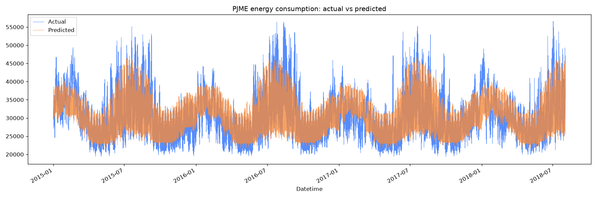
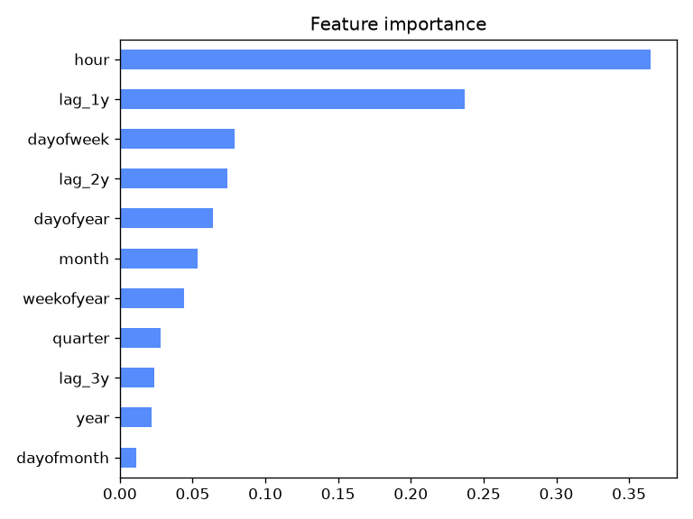

# Hourly Energy Consumption Forecasting (PJME)

Time-series forecasting of hourly electricity demand for the PJM East (PJME) region
using gradient-boosted trees (XGBoost) on calendar and long-horizon lag features.

The full analysis lives in [`energy_forecast.ipynb`](energy_forecast.ipynb).

## Data

`PJME_hourly.csv` — hourly megawatt readings from the PJM interconnection
(PJM East zone), from the public [PJM Hourly Energy Consumption](https://www.kaggle.com/datasets/robikscube/hourly-energy-consumption) dataset.

| | |
|---|---|
| Columns | `Datetime`, `PJME_MW` |
| Rows | 145,366 (145,362 after de-duplicating timestamps) |
| Range | 2002-01-01 01:00 → 2018-08-03 00:00 |
| Frequency | Hourly |

Duplicate timestamps (from daylight-saving fall-back hours) are dropped, keeping
the first occurrence, and the index is sorted chronologically.

## Approach

**Features** — all constructed so that nothing from the future leaks into a prediction:

- *Calendar features*: `hour`, `dayofweek`, `quarter`, `month`, `year`,
  `dayofyear`, `dayofmonth`, `weekofyear`. These are known arbitrarily far in
  advance for any future timestamp.
- *Lag features*: `lag_1y`, `lag_2y`, `lag_3y` — the load at roughly one, two and
  three years prior (`shift(364*24)`, `shift(728*24)`, `shift(1092*24)` hours).
  Long lags are used deliberately instead of short ones (e.g. yesterday's load)
  so the model can forecast far ahead without needing recent observations at
  prediction time. XGBoost handles the resulting `NaN`s in the early years natively.

**Split** — a single chronological hold-out, not a random shuffle:

- Train: everything before `2015-01-01`
- Test: `2015-01-01` onward

**Model** — `XGBRegressor` with `n_estimators=1000`, `learning_rate=0.05`,
`max_depth=6`, `subsample=0.9`, `colsample_bytree=0.9`, and
`early_stopping_rounds=50` evaluated on the test set (stops around iteration 111).

## Results

On the 2015–2018 hold-out period:

| Metric | Value |
|---|---|
| RMSE | 3,774 MW |
| MAE | 2,925 MW |
| MAPE | 9.31% |
| R² | 0.658 |





The model reproduces the daily and weekly demand shape well; the largest errors
come from extreme-weather peaks, which calendar and lag features alone cannot
explain.

## Setup

The project uses [uv](https://docs.astral.sh/uv/) with Python 3.12.

```bash
uv sync
uv run jupyter lab energy_forecast.ipynb
```

Core dependencies: `pandas`, `numpy`, `scikit-learn`, `xgboost`, `matplotlib`,
`seaborn`, `ipykernel`.

## Project structure

```
.
├── energy_forecast.ipynb   # end-to-end analysis: load → features → train → evaluate
├── PJME_hourly.csv         # raw hourly consumption data
├── forecast.png            # actual vs. predicted over the test period
├── feature_importance.png  # XGBoost feature importances
├── main.py                 # placeholder entry point (unused)
└── pyproject.toml          # dependencies, managed by uv
```

## Notes and limitations

- Early stopping is monitored on the test set, so the reported metrics are
  mildly optimistic. A separate validation split (or `TimeSeriesSplit` cross-
  validation, already imported in the notebook) would give a cleaner estimate.
- Lag features are computed by row offset, which assumes a contiguous hourly
  index. Any gap in the series shifts the alignment; reindexing to a complete
  hourly range before shifting would make this robust.
- No weather inputs. Temperature is the dominant driver of electricity demand,
  and adding it is the single highest-leverage improvement available here.
